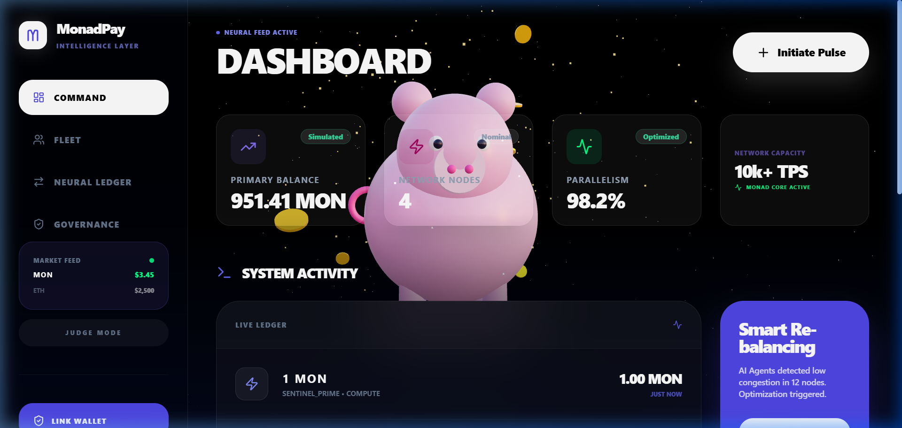
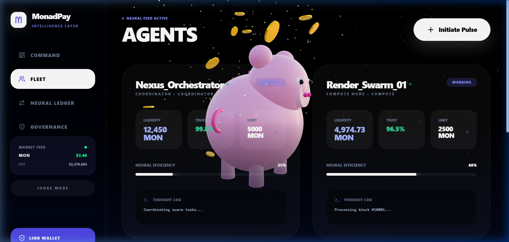
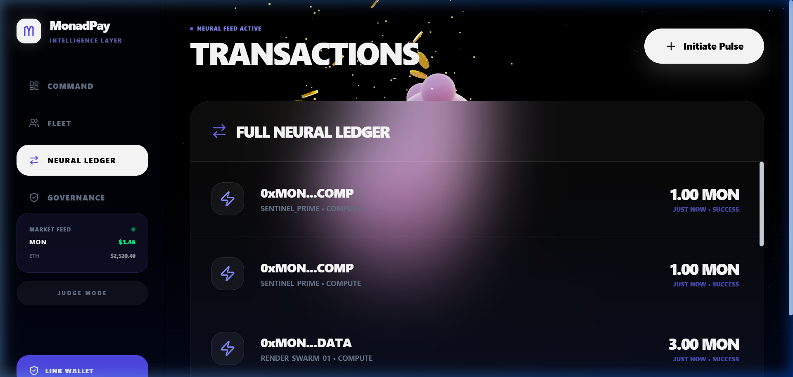
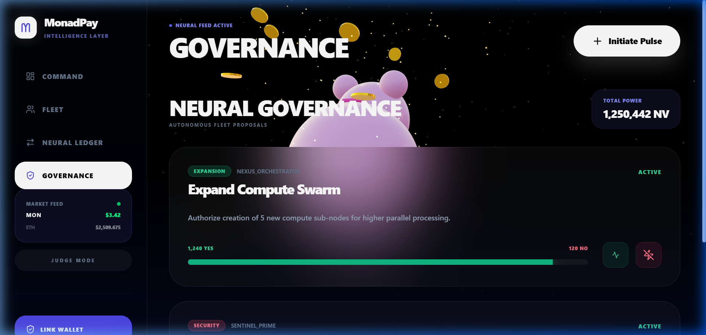
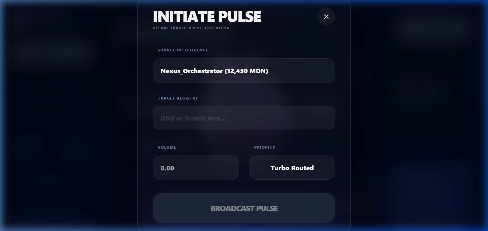

# 🚀 MonadPay — AI-Powered Payment Intelligence on Monad

<div align="center">
  
  <br/><br/>

  
  
  
  
  
  

  <br/>
  <strong>A next-generation, autonomous agent payment system built on the Monad blockchain.</strong><br/>
  <em>Real-time risk intelligence · AI agent fleet management · On-chain governance · Live Web3 wallet integration</em>
</div>

---

## 📖 Table of Contents

- [Overview](#-overview)
- [Screenshots](#-screenshots)
- [Features](#-features)
- [Tech Stack](#-tech-stack)
- [Project Architecture](#-project-architecture)
- [Core Hooks Explained](#-core-hooks-explained)
- [Tabs & Components Explained](#-tabs--components-explained)
- [Installation & Setup](#-installation--setup)
- [How It Works](#-how-it-works)

---

## 🌐 Overview

**MonadPay** is a futuristic, AI-agent payment dashboard built on top of the **Monad blockchain** — a next-generation EVM-compatible chain capable of **10,000+ TPS** (transactions per second). 

The app lets you:
- Monitor a **fleet of autonomous AI payment agents** that route funds automatically
- Use a **real-time risk engine** to block dangerous transactions
- **Vote on governance proposals** that govern the AI fleet's behaviour
- **Connect your MetaMask** wallet to see your live on-chain MON balance
- Send payments through a secure **Initiate Pulse** modal with ENS/address resolution

---

## 📸 Screenshots

### Dashboard — Neural Command Center

The main hub. Shows real-time KPIs, system activity, live ledger, and a 3D animated Monad mascot background.


---

### Fleet — AI Agent Management

The **Fleet** view lists all autonomous AI payment agents with their trust scores, balances, and real-time status indicators.



---

### Neural Ledger — Transaction History 

Every payment routed through the system is logged here. You can also initiate new payments from this view.



---

### Neural Governance — On-Chain Voting

Cast votes on active protocol proposals. Vote weight is displayed alongside live for/against tallies with a progress bar.



---

### Initiate Pulse — Payment Modal

Select a source AI agent, specify a recipient address (or ENS name), set the MON amount, and choose priority routing.



---

## ✨ Features

| Feature | Description |
|--------|-------------|
| 🤖 **AI Agent Fleet** | Manage named autonomous agents (Nexus_Orchestrator, Sentinel_Prime, etc.) each with their own balance, risk aversion, and payment allowance |
| ⚡ **Risk Engine** | Live gas-price + network-load monitor that calculates a `riskScore`. If risk is too high, agents automatically refuse transactions |
| 🔗 **Web3 Wallet** | MetaMask connection via **ethers.js v6** — shows real on-chain balance on Monad Testnet |
| 📊 **Live Market Feed** | MON, ETH, SOL prices update in real-time in the sidebar with animated loading state |
| 🗳️ **Governance** | Cast weighted votes (100 NV per vote) on Security & Optimization proposals with animated vote bars |
| 💸 **Payment Modal** | Full payment flow: source agent selector, recipient input, amount, priority (Standard / Turbo Routed) |
| 🌌 **3D Background** | Interactive Three.js scene that reacts dynamically to agent `activityLevel` and `riskLevel` |
| 🔔 **Toast Notifications** | Animated slide-in toasts for success, error, and warning states — auto-dismiss after 3 seconds |
| 💾 **Persistence** | Agent state and transaction history are persisted via `localStorage` through the `usePersistence` hook |
| ⚖️ **Judge Mode** | Toggle a special mode that changes agent simulation behavior |

---

## 🛠 Tech Stack

| Layer | Technology |
|-------|-----------|
| **Framework** | React 19 + TypeScript 5.9 |
| **Build Tool** | Vite 7 |
| **3D Rendering** | Three.js + @react-three/fiber + @react-three/drei |
| **Animations** | Framer Motion 12 |
| **Styling** | TailwindCSS 3 + custom CSS |
| **Web3** | ethers.js v6 (BrowserProvider, MetaMask) |
| **Icons** | Lucide React |
| **Utilities** | clsx, tailwind-merge |

---

## 🗂 Project Architecture

```
MonadPay/
├── src/
│   ├── AgentPayDashboard_NEW.tsx   # Root dashboard component (~270 lines)
│   ├── App.tsx                     # Entry point — wraps dashboard in ErrorBoundary
│   ├── ErrorBoundary.tsx           # React error boundary for graceful crash handling
│   │
│   ├── tabs/                       # Each main navigation tab as its own component
│   │   ├── DashboardTab.tsx        # KPI cards + live ledger + smart re-balancing
│   │   ├── AgentsTab.tsx           # AI agent fleet management view
│   │   ├── TransactionsTab.tsx     # Full transaction history
│   │   └── GovernanceTab.tsx       # Proposal voting interface
│   │
│   ├── components/
│   │   ├── 3d/
│   │   │   └── SceneBackground.tsx # Three.js 3D animated background
│   │   ├── layout/
│   │   │   ├── Header.tsx          # Page title + "Initiate Pulse" button
│   │   │   └── Sidebar.tsx         # Navigation + market feed + wallet + risk display
│   │   ├── cards/
│   │   │   ├── KPICard.tsx         # Reusable metric card (balance, nodes, etc.)
│   │   │   └── AgentIntelligenceCard.tsx  # Agent info card
│   │   └── modals/
│   │       └── PaymentModal.tsx    # Full payment flow modal
│   │
│   ├── hooks/                      # Business logic extracted into custom hooks
│   │   ├── useWallet.ts            # MetaMask / ethers.js wallet connection
│   │   ├── useRiskEngine.ts        # Gas price + network load + risk score
│   │   ├── useSimulation.ts        # Agent behavior simulation loop
│   │   └── usePersistence.ts       # localStorage read/write for agents & txns
│   │
│   ├── types/                      # TypeScript interfaces (Agent, Transaction, etc.)
│   ├── constants/
│   │   └── mockData.ts             # Initial agents, proposals, transactions, intervals
│   └── utils/
│       └── cn.ts                   # Tailwind class merger utility
│
├── public/                         # Static assets (screenshots, icons)
├── index.html
├── vite.config.ts
├── tailwind.config.js
└── package.json
```

---

## 🎣 Core Hooks Explained

### `useWallet.ts` — Web3 Connection
Manages the MetaMask connection using **ethers.js v6**.

```ts
const { isWalletConnected, userAddress, balance, connectWallet, disconnectWallet } = useWallet();
```

- On mount, it checks if a wallet is already connected via `provider.listAccounts()`
- Listens to MetaMask events: `accountsChanged` (updates address) and `chainChanged` (reloads page)
- `connectWallet()` triggers the MetaMask popup and fetches the real ETH/MON balance via `formatEther()`
- Balance is displayed live in the dashboard KPI cards

---

### `useRiskEngine.ts` — Real-Time Risk Scoring
Simulates dynamic gas price and network congestion.

```ts
const { gasPrice, networkLoad, riskScore, isGasLoading } = useRiskEngine();
```

```
riskScore = (gasPrice / 100) × 0.6 + (networkLoad / 100) × 0.4
```

- `gasPrice` fluctuates between 5–120 Gwei
- `networkLoad` fluctuates between 10–98%
- When `riskScore > 0.85` and an agent has `riskAversion > 0.1`, the payment is **automatically rejected**
- Displayed live in the sidebar with a colored indicator

---

### `useSimulation.ts` — Autonomous Agent Simulation
Runs an interval loop that makes AI agents autonomously process transactions.

```ts
useSimulation({ agents, setAgents, setTransactions, riskScore, isJudgeMode });
```

- Agents in `'working'` status continuously generate micro-transactions to verified service endpoints
- Judge Mode changes agent behavior patterns for testing/auditing
- Simulation respects the current `riskScore` — high risk slows everything down

---

### `usePersistence.ts` — LocalStorage State
Persists agent balances and transaction history across page reloads.

```ts
const { agents, setAgents, transactions, setTransactions } = usePersistence();
```

- Wraps `useState` with `localStorage` read on init and `localStorage` write on every state update
- This means if you make a payment, close the browser, and reopen — the transaction is still there

---

## 📑 Tabs & Components Explained

### 🖥 Dashboard Tab
The **Command Center** — the first thing you see.

| Section | What it shows |
|---------|--------------|
| **Primary Balance** | Your real MON balance if wallet connected, else simulated total |
| **Network Nodes** | Count of agents currently in `'working'` state |
| **Parallelism** | Fixed at 98.2% — showcases Monad's parallel execution |
| **Network Capacity** | 10k+ TPS — Monad's throughput capability |
| **Live Ledger** | Real-time feed of the last N transactions |
| **Smart Re-balancing** | AI-triggered optimization notice when congestion is low |
| **Service Health** | Trust scores for verified payment destinations |

---

### 🤖 Fleet Tab (Agents)
Shows each registered AI agent as an **Agent Intelligence Card** with:
- Agent name (e.g., `Nexus_Orchestrator`, `Sentinel_Prime`)
- Current status badge: `working` / `idle` / `blocked`
- Balance in MON
- Allowance used vs total
- Risk aversion rating

---

### 📜 Neural Ledger Tab (Transactions)
A scrollable log of every transaction routed through the system showing:
- **Sender** (agent name) and **Recipient** (address or ENS)
- **Amount** in MON
- **Type** (Compute, Transfer, etc.)
- **Timestamp**

---

### 🗳 Governance Tab
Shows **autonomous fleet proposals** with:
- **Proposal type**: Security 🔴 or Optimization 🟢
- **Description** from the proposer
- **Live vote tally**: Yes votes vs No votes
- **Animated progress bar** showing current consensus
- Vote buttons (thumbs up = +100 NV, thumbs down = +100 against)
- Total voting power displayed: `1,250,442 NV`

---

### 💳 Payment Modal (Initiate Pulse)
The core action modal — triggered from the header button:

1. **Source Intelligence** — Dropdown to select which AI agent should send the funds
2. **Target Registry** — Input for recipient ETH address or ENS name (e.g., `vitalik.eth`)
3. **Volume** — Amount in MON to transfer
4. **Priority** — Standard or **Turbo Routed** (higher priority, faster routing)
5. On submit, the system checks: agent exists → risk threshold → sufficient balance → then executes

---

## 🚀 Installation & Setup

### Prerequisites
- Node.js 18+
- npm or yarn
- MetaMask browser extension (optional, for live wallet)

### Run Locally

```bash
# Clone the repository
git clone https://github.com/your-username/monadpay.git
cd monadpay/MonadPay

# Install dependencies
npm install

# Start development server
npm run dev
```

Open [http://localhost:5173](http://localhost:5173) in your browser.

### Build for Production

```bash
npm run build
```

Output goes to the `dist/` folder — ready to deploy on Vercel, Netlify, or any static host.

---

## ⚙️ How It Works

```
User opens app
    ↓
AgentPayDashboard_NEW.tsx mounts
    ↓
useWallet   → checks MetaMask for existing connection
usePersistence → loads agents + transactions from localStorage
useRiskEngine  → starts interval: updates gasPrice + networkLoad → calc riskScore
useSimulation  → starts interval: agents auto-process transactions using riskScore
    ↓
User clicks "Initiate Pulse"
    ↓
PaymentModal opens → user picks agent, enters recipient + amount
    ↓
handlePay() called:
  1. Find agent in state
  2. Check riskScore vs agent.riskAversion
  3. Validate amount > 0 and ≤ agent.balance
  4. Deduct balance, add new Transaction to state
  5. usePersistence auto-saves to localStorage
  6. Toast notification fires (success / error / warning)
```

---

## 📄 License

MIT © MonadPay Contributors

---

<div align="center">
  <strong>Built with ❤️ on <a href="https://monad.xyz">Monad</a> — The Parallel EVM</strong>
</div>
